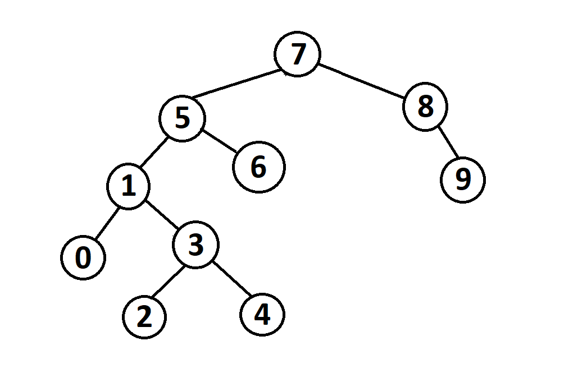

# Proje 3
## [7,5,1,8,3,6,0,9,4,2] -> Binary-Search-Tree
---
* Yukarıda verilen dizinin Binary-Search-Tree aşamalarını yazınız.
1.      root 7' dir.
2.      root' un solunda 5 bulunur.
3.      1 sol kısımda 5' e bağlıdır.
4.      8 root' un sağındadır.
5.      3 sol kısımda 1' e bağlıdır.
6.      6 sol kısımda 5' e bağlıdır.
7.      0 sol kısımda 1' e bağlıdır.
8.      9 sağ kısımda 8' e bağlıdır.
9.      4 sol kısımda 3' e bağlıdır.
10.      2 sol kısımda 3'e bağlıdır.
---
  
            
